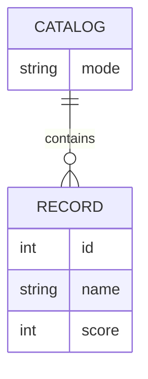

# Domain Model

The system revolves around a single catalog of scored records, held by Service2 and summarized by Service1.

- **Catalog** is Service2's singleton operational state: `mode` is either `full` or `empty`. There is exactly one Catalog at any time — switching modes replaces which records it contains, not the concept itself.
- **Record** is a scored item: `id`, `name`, `score`. In full mode the Catalog contains exactly the 10 fixed records; in empty mode it contains none.

