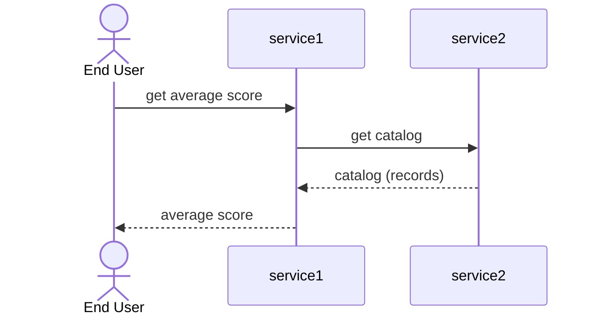

# End User gets the average score

An End User asks Service1 for the current average score; Service1 fetches the current catalog from Service2 and computes it.

```mermaid
sequenceDiagram
    actor EndUser as End User
    participant service1
    participant service2

    EndUser->>service1: get average score
    service1->>service2: get catalog
    service2-->>service1: catalog (records)
    service1-->>EndUser: average score
```

